  

  

  
  

---

### 👨‍💻 Sobre mim

Analista de Suporte N3 com **15+ anos em TI** e coordenação técnica de uma operação
que atende cerca de **4 mil usuários**. Pego um problema real da operação e transformo
em sistema: triagem de chamados com IA, gestão de cadastros, controle de ambientes de prova.

- 🔭 Destaque: **[IA Triagem de Chamados](https://github.com/josecardosodev/nat-ia-triagem)**, API que classifica chamados com o Claude (Anthropic)
- 🌱 Estudando: FastAPI, testes automatizados e IA generativa aplicada a processos
- 🎓 Graduação em Processos Gerenciais (FGV)
- ⚡ Diferencial: entendo a **infraestrutura** onde o código vai rodar

### 🛠️ Stack

  

  
  
  
  
  
  
  
  

### 🚀 Projetos

| Projeto | O que faz | Stack |
|---|---|---|
| 🤖 [**IA Triagem de Chamados**](https://github.com/josecardosodev/nat-ia-triagem) | Classifica chamados técnicos com IA: categoria, prioridade e informação faltante | FastAPI · Claude · PostgreSQL · pytest |
| 🏛️ **Gestão de Funcionários** | Cadastro, pagamentos, benefícios e relatórios. Em produção há mais de 1 ano | Streamlit · SQLite · Pandas |
| 🛡️ **ZeroCola** | Controle de ambiente de prova: bloqueio de IA, atalhos e DevTools em laboratórios | Python · Windows · PowerShell |

Projetos em produção institucional têm código privado. Detalhes no [portfólio](https://github.com/josecardosodev/Portif-lio).

### 📊 GitHub

  
  

  

